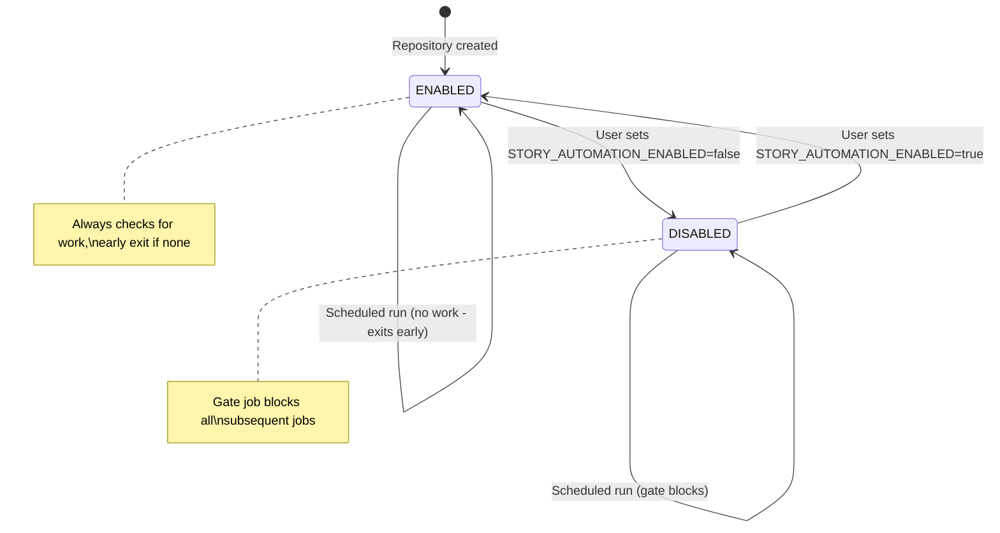

# Story Tree Meta-Workflow Design (v4)

This document describes the orchestration strategy for running story-tree automation in a loop until the pipeline is drained.

## Problem Statement

The project has story-tree automation workflows that need coordination:

| Workflow | Purpose | Cadence |
|----------|---------|---------|
| `plan-stories.yml` | Create implementation plans for approved stories | Part of loop |
| `write-stories.yml` | Generate new concept stories | Part of loop |
| `synthesize-goals-non-goals.yml` | Generate vision documentation | Separate (daily) |

**Problems with v3 approach:**
- Wrong pipeline order: write→plan creates concept glut
- Single cycle per night leaves work undone
- Synthesize-goals in loop wastes cycles (only changes with user input)

## Solution: Looping Orchestrator

Create an **orchestrator workflow** that loops until the pipeline is idle:
- **Plan first**: Drain approved stories before adding new ones
- **Loop until idle**: Keep cycling until NO_APPROVED AND NO_CAPACITY
- **Synthesize separately**: Keep goal synthesis as independent daily workflow

### Architecture

```
┌─────────────────────────────────────────────────────────────────┐
│                    story-tree-orchestrator                      │
│                  (runs daily at 2:00 AM PST)                    │
└──────────────────────────────┬──────────────────────────────────┘
                               │
                               ▼
                    ┌──────────────────────┐
                    │        GATE          │
                    │ Check if automation  │
                    │    is enabled        │
                    └──────────┬───────────┘
                               │
              ┌────────────────┴────────────────┐
              │                                 │
         [DISABLED]                       [ENABLED]
              │                                 │
              ▼                                 ▼
        ┌──────────┐              ┌─────────────────────────────┐
        │   EXIT   │              │      drain-pipeline         │
        │ (skip)   │              │   (loop until idle)         │
        └──────────┘              └─────────────┬───────────────┘
                                                │
                                  ┌─────────────┴─────────────┐
                                  │                           │
                                  │  ┌──────────────────────┐ │
                                  │  │    plan-stories      │ │
                                  │  │  (drain approved)    │ │
                                  │  └──────────┬───────────┘ │
                                  │             │             │
                                  │             ▼             │
                                  │  ┌──────────────────────┐ │
                                  │  │   write-stories      │ │
                                  │  │  (fill capacity)     │ │
                                  │  └──────────┬───────────┘ │
                                  │             │             │
                                  │    ┌────────┴────────┐    │
                                  │    │ Both idle?      │    │
                                  │    │ NO_APPROVED &&  │    │
                                  │    │ NO_CAPACITY     │    │
                                  │    └────────┬────────┘    │
                                  │             │             │
                                  │      ┌──────┴──────┐      │
                                  │    [NO]          [YES]    │
                                  │      │             │      │
                                  │      │ (loop)      │      │
                                  │      └─────────────│──────│
                                  │                    │      │
                                  └────────────────────│──────┘
                                                       │
                                                       ▼
                                            ┌───────────────────────┐
                                            │       summary         │
                                            │   Report loop results │
                                            │   GITHUB_STEP_SUMMARY │
                                            └───────────────────────┘
```

### Key Design Decisions

#### 1. Master Switch via Repository Variable

A single repository variable controls the entire automation:

```
Variable: STORY_AUTOMATION_ENABLED
Values: "true" | "false"
Default: "true"
Location: Settings > Secrets and variables > Actions > Variables
```

When set to `false`, the gate job exits early and all subsequent jobs are skipped.

#### 2. Pipeline Order: Drain Before Fill

**Principle**: Clear downstream work before creating upstream work.

```
Plan first → Write second
(drain)      (fill)
```

This prevents "concept glut" where approved stories pile up waiting for planning while new concepts keep being added.

#### 3. Loop Until Idle

The orchestrator loops internally until **both** conditions are true:
- `NO_APPROVED`: No approved stories waiting for planning
- `NO_CAPACITY`: All tree nodes at capacity

| Exit Condition | Meaning |
|----------------|---------|
| `IDLE` | Both NO_APPROVED and NO_CAPACITY in same cycle |
| `MAX_CYCLES` | Safety limit reached (default: 10) |
| `ERROR` | Script or Claude failure |

#### 4. Concurrency Group

```yaml
concurrency:
  group: story-tree-automation
  cancel-in-progress: false
```

This prevents multiple orchestrator runs from overlapping.

#### 5. Synthesize-Goals is Separate

Goal synthesis only changes when the user acts (approves/rejects stories). Since there's no user input during CI, it runs as a separate daily workflow, not part of the loop.

## State Diagram



**Design note:** Earlier iterations included a `PAUSED` state that would auto-pause after N consecutive idle runs. This was removed as unnecessary complexity - the early-exit mechanism is sufficient and doesn't require persistent state tracking.

## Jobs Specification

### Job 1: gate

**Purpose:** Check if automation is enabled

```yaml
gate:
  runs-on: ubuntu-latest
  outputs:
    enabled: ${{ steps.check.outputs.enabled }}
  steps:
    - id: check
      run: |
        if [ "${{ vars.STORY_AUTOMATION_ENABLED }}" = "false" ]; then
          echo "enabled=false" >> $GITHUB_OUTPUT
          echo "Automation is disabled"
        else
          echo "enabled=true" >> $GITHUB_OUTPUT
        fi
```

### Job 2: drain-pipeline

**Purpose:** Loop plan→write until pipeline is idle

**Triggers:** Runs if gate.enabled=true

**Loop Logic (pseudo-code):**
```python
cycle = 0
max_cycles = inputs.max_cycles or 10

while cycle < max_cycles:
    # Step 1: Plan stories (drain approved backlog)
    approved_count = query_db("SELECT COUNT(*) FROM stories WHERE status='approved'")
    if approved_count > 0:
        run_claude_code("story-planning-ci skill")
        git_commit_push_if_changes()
        plan_result = "SUCCESS"
    else:
        plan_result = "NO_APPROVED"

    # Step 2: Write stories (fill capacity)
    capacity_output = run("story_workflow.py --ci")
    if "NO_CAPACITY" not in capacity_output:
        run_claude_code("generate story")
        run("insert_story.py")
        git_commit_push_if_changes()
        write_result = "SUCCESS"
    else:
        write_result = "NO_CAPACITY"

    # Check exit condition
    if plan_result == "NO_APPROVED" and write_result == "NO_CAPACITY":
        exit_reason = "IDLE"
        break

    cycle += 1

if cycle >= max_cycles:
    exit_reason = "MAX_CYCLES"
```

**Outputs:**
- `cycles_completed`: Number of iterations run
- `plans_created`: Total plans created across all cycles
- `stories_created`: Total stories created across all cycles
- `exit_reason`: `IDLE` | `MAX_CYCLES` | `ERROR`

### Job 3: summary

**Purpose:** Generate pipeline summary

**Triggers:** Always runs after drain-pipeline

**Steps:**
1. Collect results from drain-pipeline
2. Write summary to `GITHUB_STEP_SUMMARY` showing:
   - Cycles completed
   - Stories created
   - Plans created
   - Exit reason

## Usage

### Enable/Disable Automation

To disable all story automation:
1. Go to repository Settings
2. Navigate to Secrets and variables > Actions > Variables
3. Set `STORY_AUTOMATION_ENABLED` to `false`

To re-enable:
1. Set `STORY_AUTOMATION_ENABLED` to `true`

### Manual Trigger with Options

The orchestrator supports manual dispatch:

```yaml
workflow_dispatch:
  inputs:
    max_cycles:
      type: number
      default: 10
      description: Maximum loop iterations (safety limit)
```

### Running Individual Workflows

The original workflows can still be triggered manually via `workflow_dispatch`:
- `write-stories.yml` - One-off story generation
- `plan-stories.yml` - One-off planning
- `synthesize-goals-non-goals.yml` - Runs on its own daily schedule (not part of loop)

## Implementation Files

| File | Purpose |
|------|---------|
| `.github/workflows/story-tree-orchestrator.yml` | Main orchestrator (to be created) |
| `.github/workflows/write-stories.yml` | Existing - kept for manual runs |
| `.github/workflows/plan-stories.yml` | Existing - kept for manual runs |
| `.github/workflows/synthesize-goals-non-goals.yml` | Separate daily workflow (not part of loop) |

## Design Evolution

### Version 1
- Used `workflow_call` to chain workflows
- **Flaw:** `workflow_call` makes workflows run as jobs in the same runner, not true sequential runs
- **Flaw:** Output communication from Claude Code action was complex

### Version 2
- Added status files for state persistence
- Added PAUSED state with idle run tracking
- **Flaw:** State files require commits, adding git history noise
- **Flaw:** PAUSED state added unnecessary complexity

### Version 3
- Simplified to two states: ENABLED and DISABLED
- No persistent state files - early exit is sufficient
- Single repository variable as master switch
- **Flaw:** Wrong pipeline order (write→plan) creates concept glut
- **Flaw:** Single cycle per night leaves work undone
- **Flaw:** synthesize-goals in loop (wrong cadence)

### Version 4 (Current)
- **Reversed pipeline order**: plan-stories FIRST, then write-stories
- **Loop until idle**: Continue until NO_CAPACITY AND NO_APPROVED
- **Removed synthesize-goals from loop**: Runs as separate daily workflow
- Single drain-pipeline job with internal shell loop
