# Complete Orchestrator Workflow (Target State)

This diagram shows the **complete target state** for a fully integrated orchestrator that handles all stage transitions in a unified drain-pipeline pattern.

---

## Design Philosophy

**Drain-Forward Pattern**: Process later stages FIRST to make room, then earlier stages.

The orchestrator should:
1. **Drain the pipeline** - Move stories forward through stages
2. **Fill from the top** - Only add new work when capacity exists
3. **Gate appropriately** - Use holds to pause stories needing attention

**Vetting as a Funnel**: Reduce human workload, don't add to it.

Vetting filters OUT conflicting concepts automatically:
1. **Deterministic script** - Removes obvious duplicates/overlaps
2. **LLM analysis** - Removes semantic conflicts
3. **Human review** - Approves only clean, non-conflicting concepts

Conflicting concepts are auto-disposed (`disposition='conflict'`), NOT held for human review. The human's job is to evaluate good ideas, not arbitrate conflicts. Using `conflict` instead of `rejected` preserves goal/non-goal signal clarity.

---

## Complete Stage Lifecycle

```mermaid
stateDiagram-v2
    direction TB

    [*] --> concept: write-stories<br/>(fill capacity)

    state "💡 concept (queued)" as CONCEPT_QUEUED
    state "💡 concept (no hold)" as CONCEPT
    state "✅ approved (no hold)" as APPROVED
    state "📋 planned (no hold)" as PLANNED
    state "📋 planned (blocked)" as PLANNED_BLOCKED
    state "🔨 active (no hold)" as ACTIVE
    state "🔨 active (pending)" as ACTIVE_PENDING
    state "👀 reviewing (no hold)" as REVIEWING
    state "🧪 verifying (no hold)" as VERIFYING
    state "✔️ implemented (no hold)" as IMPLEMENTED
    state "🏁 ready (no hold)" as READY
    state "🚀 released" as RELEASED
    state "❌ disposed (conflict)" as DISPOSED

    concept --> CONCEPT_QUEUED: write-stories<br/>new story created

    CONCEPT_QUEUED --> CONCEPT: vet-stories<br/>no conflicts
    CONCEPT_QUEUED --> DISPOSED: vet-stories<br/>disposition='conflict'

    CONCEPT --> APPROVED: approve-stories

    APPROVED --> PLANNED: plan-stories

    PLANNED --> ACTIVE: activate-stories<br/>deps met
    PLANNED --> PLANNED_BLOCKED: activate-stories<br/>deps unmet + record blockers
    PLANNED_BLOCKED --> PLANNED: activate-stories<br/>recorded blockers resolved

    ACTIVE --> REVIEWING: execute-stories<br/>deferrable issues
    ACTIVE --> VERIFYING: execute-stories<br/>no issues
    ACTIVE --> ACTIVE_PENDING: execute-stories<br/>blocking issues

    REVIEWING --> VERIFYING: 👤 review-stories<br/>review passed

    VERIFYING --> IMPLEMENTED: verify-stories<br/>tests pass

    IMPLEMENTED --> READY: ready-check<br/>integration OK

    READY --> RELEASED: 👤 deploy.yml<br/>(manual trigger)

    %% Semantic class definitions for stage types
    classDef conceptStage fill:#fff9e6,stroke:#cc9900,stroke-width:2px
    classDef approvedStage fill:#e6f7ff,stroke:#0099cc,stroke-width:2px
    classDef workingStage fill:#e6f3ff,stroke:#0066cc,stroke-width:2px
    classDef reviewStage fill:#ffcccc,stroke:#cc0000,stroke-width:2px
    classDef doneStage fill:#e6ffe6,stroke:#009900,stroke-width:2px
    classDef blockedStage fill:#ffe6e6,stroke:#cc6600,stroke-width:2px
    classDef disposedStage fill:#e6e6e6,stroke:#666666,stroke-width:2px

    %% Apply classes to states by stage type
    class CONCEPT_QUEUED,CONCEPT conceptStage
    class APPROVED approvedStage
    class PLANNED,ACTIVE workingStage
    class PLANNED_BLOCKED,ACTIVE_PENDING blockedStage
    class REVIEWING,VERIFYING reviewStage
    class IMPLEMENTED,READY,RELEASED doneStage
    class DISPOSED disposedStage
```



**Legend**: 🤖 CI-automatable transitions (default styling) | 👤 Human-required transitions (red styling)

**Key Design Decision**: There is NO direct path from `planned (blocked)` to `active`. All planned stories must pass through `planned (no hold)` for a fresh dependency check before activation. This ensures that even if recorded blockers are resolved, any NEW dependencies that emerged are detected.

---

## Complete Orchestrator Loop Structure

```mermaid
flowchart TD
    START([Workflow Triggered])

    GATE{Gate:<br/>STORY_AUTOMATION_ENABLED?}
    START --> GATE
    GATE -->|false| DISABLED([Exit: Disabled])
    GATE -->|true| INIT

    subgraph LOOP["Main Loop (max N cycles)"]
        INIT[Initialize Cycle<br/>cycle++]

        %% DRAIN PHASE - Process later stages first
        subgraph DRAIN["Phase 1: DRAIN (Later → Earlier)"]
            direction TB

            subgraph D1["Step 1: verify-stories"]
                D1_CHECK{verifying stories<br/>without holds?}
                D1_RUN["story-verification skill"]
                D1_PASS["verifying → implemented"]
                D1_FAIL["verifying (broken)"]
            end

            subgraph D2["Step 2: review-stories 👤 HUMAN REQUIRED"]
                D2_CHECK{reviewing stories<br/>without holds?}
                D2_RUN["Human code review<br/>(not automated)"]
                D2_PASS["reviewing → verifying"]
                D2_FAIL["reviewing (broken)"]
            end

            subgraph D3["Step 3: execute-stories"]
                D3_CHECK{active stories<br/>without holds?}
                D3_RUN["story-execution skill"]
                D3_CLEAN["active → verifying"]
                D3_DEFER["active → reviewing"]
                D3_BLOCK["active (pending)"]
            end

            subgraph D4["Step 4: activate-stories"]
                D4_CHECK{planned stories<br/>to process?}
                D4_UNBLOCK["Step 4a: UNBLOCK<br/>check recorded blockers"]
                D4_ACTIVATE["Step 4b: ACTIVATE<br/>full dependency check"]
                D4_PASS["planned → active"]
                D4_FAIL["planned (blocked:IDs)"]
            end

            subgraph D5["Step 5: plan-stories"]
                D5_CHECK{approved stories<br/>without holds?}
                D5_RUN["story-planning skill"]
                D5_DONE["approved → planned"]
            end

            D1_CHECK -->|Yes| D1_RUN
            D1_RUN -->|pass| D1_PASS
            D1_RUN -->|fail| D1_FAIL
            D1_CHECK -->|No| D2_CHECK
            D1_PASS --> D2_CHECK
            D1_FAIL --> D2_CHECK

            D2_CHECK -->|Yes| D2_RUN
            D2_RUN -->|pass| D2_PASS
            D2_RUN -->|fail| D2_FAIL
            D2_CHECK -->|No| D3_CHECK
            D2_PASS --> D3_CHECK
            D2_FAIL --> D3_CHECK

            D3_CHECK -->|Yes| D3_RUN
            D3_RUN -->|clean| D3_CLEAN
            D3_RUN -->|deferrable| D3_DEFER
            D3_RUN -->|blocking| D3_BLOCK
            D3_CHECK -->|No| D4_CHECK
            D3_CLEAN --> D4_CHECK
            D3_DEFER --> D4_CHECK
            D3_BLOCK --> D4_CHECK

            D4_CHECK -->|Yes| D4_UNBLOCK
            D4_UNBLOCK --> D4_ACTIVATE
            D4_ACTIVATE -->|met| D4_PASS
            D4_ACTIVATE -->|unmet| D4_FAIL
            D4_CHECK -->|No| D5_CHECK
            D4_PASS --> D5_CHECK
            D4_FAIL --> D5_CHECK

            D5_CHECK -->|Yes| D5_RUN
            D5_RUN --> D5_DONE
            D5_CHECK -->|No| DRAIN_DONE
            D5_DONE --> DRAIN_DONE
        end

        DRAIN_DONE[Drain Phase Complete]

        %% FILL PHASE - Add new work
        subgraph FILL["Phase 2: FILL (Add New Work)"]
            direction TB

            subgraph F1["Step 6: write-stories"]
                F1_CHECK{Capacity for<br/>new stories?}
                F1_RUN["story-writing skill"]
                F1_DONE["NEW → concept (queued)"]
            end

            subgraph F2["Step 7: vet-stories"]
                F2_CHECK{Queued concepts<br/>to vet?}
                F2_RUN["story-vetting skill"]
                F2_CONFLICT["disposition='conflict'"]
                F2_CLEAN["clear queued hold"]
            end

            subgraph F3["Step 8: approve-stories"]
                F3_CHECK{Vetted concepts<br/>without holds?}
                F3_RUN["auto-approve logic"]
                F3_DONE["concept → approved"]
            end

            F1_CHECK -->|Yes| F1_RUN
            F1_RUN --> F1_DONE
            F1_CHECK -->|No| F2_CHECK
            F1_DONE --> F2_CHECK

            F2_CHECK -->|Yes| F2_RUN
            F2_RUN -->|conflict| F2_CONFLICT
            F2_RUN -->|clean| F2_CLEAN
            F2_CHECK -->|No| F3_CHECK
            F2_CONFLICT --> F3_CHECK
            F2_CLEAN --> F3_CHECK

            F3_CHECK -->|Yes| F3_RUN
            F3_RUN --> F3_DONE
            F3_CHECK -->|No| FILL_DONE
            F3_DONE --> FILL_DONE
        end

        FILL_DONE[Fill Phase Complete]

        INIT --> DRAIN
        DRAIN_DONE --> FILL
        FILL_DONE --> EXIT_CHECK

        EXIT_CHECK{All stages idle?<br/>no work remaining}
    end

    EXIT_CHECK -->|Yes| IDLE([Exit: IDLE])
    EXIT_CHECK -->|No| CYCLE_CHECK{cycle < max?}
    CYCLE_CHECK -->|Yes| INIT
    CYCLE_CHECK -->|No| MAX([Exit: MAX_CYCLES])

    SUMMARY[Generate Progress Report]
    IDLE --> SUMMARY
    MAX --> SUMMARY

    %% Semantic class definitions for node types
    classDef startNode fill:#e6f3ff,stroke:#0066cc,stroke-width:2px
    classDef checkNode fill:#fff9e6,stroke:#cc9900,stroke-width:2px
    classDef runNode fill:#e6f7ff,stroke:#0099cc,stroke-width:2px
    classDef passNode fill:#e6ffe6,stroke:#009900,stroke-width:2px
    classDef failNode fill:#ffe6e6,stroke:#cc0000,stroke-width:2px
    classDef phaseNode fill:#f0e6ff,stroke:#6600cc,stroke-width:2px
    classDef exitNode fill:#f5f5f5,stroke:#666666,stroke-width:2px
    classDef humanRequired fill:#ffcccc,stroke:#cc0000,stroke-width:3px

    %% Apply classes to nodes by type
    class START,INIT startNode
    class GATE,EXIT_CHECK,CYCLE_CHECK checkNode
    class D1_CHECK,D2_CHECK,D3_CHECK,D4_CHECK,D5_CHECK,F1_CHECK,F2_CHECK,F3_CHECK checkNode
    class D1_RUN,D3_RUN,D5_RUN,F1_RUN,F2_RUN,F3_RUN runNode
    class D1_PASS,D2_PASS,D3_CLEAN,D3_DEFER,D4_PASS,D5_DONE,F1_DONE,F2_CLEAN,F3_DONE passNode
    class D1_FAIL,D2_FAIL,D3_BLOCK,D4_FAIL,F2_CONFLICT failNode
    class DRAIN_DONE,FILL_DONE phaseNode
    class DISABLED,IDLE,MAX,SUMMARY exitNode
    class D2_CHECK,D2_RUN,D2_PASS,D2_FAIL humanRequired
    class D4_UNBLOCK,D4_ACTIVATE runNode
```



**Note**: The D2 (review-stories) step is shown for completeness but is **NOT automated** by the orchestrator. Stories in `reviewing` stage wait for human code review before transitioning to `verifying`.

---

## Transition Summary Table

| Step | Workflow/Skill | From State | To State | Hold Outcomes | Automation |
|------|---------------|------------|----------|---------------|------------|
| 1 | `verify-stories` | verifying (no hold) | implemented (no hold) | → (broken) if tests fail | 🤖 CI |
| 2 | `review-stories` | reviewing (no hold) | verifying (no hold) | → (broken) if issues found | 👤 Human |
| 3 | `execute-stories` | active (no hold) | reviewing/verifying | → (pending) if blocking | 🤖 CI |
| 4a | `activate-stories` | planned (blocked) | planned (no hold) | When recorded blockers resolved | 🤖 CI |
| 4b | `activate-stories` | planned (no hold) | active (no hold) | → (blocked:IDs) if deps unmet | 🤖 CI |
| 5 | `plan-stories` | approved (no hold) | planned (no hold) | - | 🤖 CI |
| 6 | `write-stories` | NEW | concept (queued) | - | 🤖 CI |
| 7 | `vet-stories` | concept (queued) | concept (no hold) | → conflict if overlaps | 🤖 CI |
| 8 | `approve-stories` | concept (no hold) | approved (no hold) | - | 🤖 CI |
| 9 | `deploy.yml` | ready (no hold) | released | - | 👤 Human |

---

## Workflows to Implement

| Workflow | Status | Purpose | Integration |
|----------|--------|---------|-------------|
| `story-tree-orchestrator.yml` | ✅ Partial | Main loop - needs expansion | 🤖 CI Core |
| `write-stories.yml` | ✅ Exists | Standalone - integrate | 🤖 CI |
| `plan-stories.yml` | ✅ Exists | Standalone - integrate | 🤖 CI |
| `activate-stories.yml` | ✅ Exists | Needs update for UNBLOCK + cycle detection | 🤖 CI |
| `execute-stories.yml` | ✅ Exists | Standalone - integrate | 🤖 CI |
| `review-stories.yml` | ❌ Missing | NEW: reviewing → verifying | 👤 Standalone only |
| `verify-stories.yml` | ❌ Missing | NEW: verifying → implemented | 🤖 CI |
| `ready-check.yml` | ❌ Missing | NEW: implemented → ready | 🤖 CI |
| `approve-stories.yml` | ❌ Missing | NEW: auto-approve clean concepts | 🤖 CI |
| `deploy.yml` | ❌ Missing | NEW: ready → released | 👤 Manual trigger |

> **Note**: `review-stories.yml` is **standalone-only** and NOT part of the orchestrator loop. Human code review cannot be automated; this workflow provides tooling to assist the review process but requires human judgment to complete the transition.

---

## Hold State Handling


---

## Dependency Management in activate-stories

The `activate-stories` workflow is responsible for ALL dependency-related transitions for planned stories. This consolidates dependency logic in one place.

### hold_reason Format for Blocked Stories

When a story is blocked, the specific blocker node IDs are recorded:

```
blocked:1.2.1.2,1.3.4,2.1
```

This format:
- Starts with `blocked:` prefix
- Lists comma-separated story node path IDs
- Makes blocking relationships explicit and traceable
- Enables efficient unblocking checks without re-querying the full dependency tree

### activate-stories Two-Step Flow

```mermaid
flowchart TD
    START[activate-stories begins]

    subgraph STEP1["Step 1: UNBLOCK (process blocked stories first)"]
        S1_FIND[Find all planned stories<br/>with hold_reason LIKE 'blocked:%']
        S1_LOOP{For each<br/>blocked story}
        S1_PARSE[Parse blocker IDs from hold_reason]
        S1_CHECK{All blockers<br/>implemented, released,<br/>or disposed?}
        S1_CLEAR[Clear hold_reason<br/>→ planned (no hold)]
        S1_KEEP[Keep blocked]
    end

    subgraph STEP2["Step 2: ACTIVATE (full dependency check)"]
        S2_FIND[Find all planned stories<br/>without hold_reason]
        S2_LOOP{For each<br/>unblocked story}
        S2_ANALYZE[Full dependency analysis]
        S2_MET{Dependencies<br/>met?}
        S2_ACTIVATE[→ active (no hold)]
        S2_BLOCK_NEW[Identify blocker IDs]
        S2_CYCLE{Cycle<br/>detected?}
        S2_RESOLVE[Clear stale blocks<br/>in cycle chain]
        S2_APPLY[→ planned (blocked:IDs)]
    end

    START --> S1_FIND
    S1_FIND --> S1_LOOP
    S1_LOOP -->|next| S1_PARSE
    S1_PARSE --> S1_CHECK
    S1_CHECK -->|yes| S1_CLEAR
    S1_CHECK -->|no| S1_KEEP
    S1_CLEAR --> S1_LOOP
    S1_KEEP --> S1_LOOP
    S1_LOOP -->|done| S2_FIND

    S2_FIND --> S2_LOOP
    S2_LOOP -->|next| S2_ANALYZE
    S2_ANALYZE --> S2_MET
    S2_MET -->|yes| S2_ACTIVATE
    S2_MET -->|no| S2_BLOCK_NEW
    S2_BLOCK_NEW --> S2_CYCLE
    S2_CYCLE -->|yes| S2_RESOLVE
    S2_CYCLE -->|no| S2_APPLY
    S2_RESOLVE --> S2_APPLY
    S2_ACTIVATE --> S2_LOOP
    S2_APPLY --> S2_LOOP
    S2_LOOP -->|done| END[activate-stories complete]

    %% Semantic class definitions
    classDef startNode fill:#e6f3ff,stroke:#0066cc,stroke-width:2px
    classDef findNode fill:#e6f7ff,stroke:#0099cc,stroke-width:2px
    classDef loopNode fill:#fff9e6,stroke:#cc9900,stroke-width:2px
    classDef checkNode fill:#fff4cc,stroke:#ccaa00,stroke-width:2px
    classDef actionNode fill:#f0e6ff,stroke:#6600cc,stroke-width:2px
    classDef successNode fill:#e6ffe6,stroke:#009900,stroke-width:2px
    classDef blockNode fill:#ffe6e6,stroke:#cc6600,stroke-width:2px
    classDef terminal fill:#f5f5f5,stroke:#666666,stroke-width:2px

    %% Apply classes
    class START,END terminal
    class S1_FIND,S2_FIND findNode
    class S1_LOOP,S2_LOOP loopNode
    class S1_CHECK,S2_MET,S2_CYCLE checkNode
    class S1_PARSE,S2_ANALYZE,S2_BLOCK_NEW,S2_RESOLVE actionNode
    class S1_CLEAR,S2_ACTIVATE successNode
    class S1_KEEP,S2_APPLY blockNode
```

### Processing Order Rationale

1. **Blocked stories first**: Check if recorded blockers are resolved, promoting them to `planned (no hold)`
2. **Unblocked stories second**: Includes both originally unblocked AND freshly unblocked stories from step 1

This ensures freshly unblocked stories get a full dependency re-check in the same cycle, catching any NEW dependencies that may have emerged since they were originally blocked.

---

## Circular Dependency Detection & Resolution

Cross-branch dependencies are allowed, which means circular dependencies are possible. The system detects and resolves them using a "newest analysis wins" strategy.

### Why Newest Wins

Code changes constantly. A dependency analysis from 2 weeks ago may no longer reflect reality. When a cycle is detected, the most recent analysis is considered more trustworthy because it was performed against the current codebase.

### Cycle Detection Algorithm

```
When activate-stories is about to mark story X as blocked by [B1, B2, ...]:

For each blocker B in [B1, B2, ...]:
    Walk B's block chain: B → B's blockers → their blockers → ...
    If X appears anywhere in that chain:
        ⚠️ CYCLE DETECTED

        Resolution:
        1. Find all stories in the chain from B back to X
        2. Clear their hold_reason (set to NULL)
        3. Add note: "CYCLE RESOLVED: stale block cleared"
        4. These stories return to planned (no hold) for re-evaluation

Then: Apply new block - X.hold_reason = 'blocked:B1,B2,...'
```

### Cycle Resolution Example

**Before** (stale state):
```
1.1 → blocked:1.2     (old analysis)
1.2 → blocked:1.3     (old analysis)
1.3 → (no hold)
```

**Today**: activate-stories analyzes 1.3, finds it depends on 1.1

**Cycle detected**: 1.3 → 1.1 → 1.2 → 1.3

**Resolution**:
1. Trace back from 1.1: finds chain 1.1 → 1.2 → 1.3 (back to current story)
2. Clear stale blocks: 1.1 and 1.2 → `planned (no hold)`
3. Apply new block: 1.3 → `blocked:1.1`

**After**:
```
1.1 → (no hold)        ← cleared, will be re-evaluated
1.2 → (no hold)        ← cleared, will be re-evaluated
1.3 → blocked:1.1      ← new, current analysis
```

### SQL for Cycle Detection

```sql
-- Walk the block chain from a given story
-- Returns all stories that would be in the dependency chain
WITH RECURSIVE block_chain AS (
    -- Start with the potential blocker
    SELECT
        id,
        node_path,
        hold_reason,
        1 as depth
    FROM story_nodes
    WHERE node_path = :blocker_path
      AND hold_reason LIKE 'blocked:%'

    UNION ALL

    -- Follow each blocker in the chain
    SELECT
        s.id,
        s.node_path,
        s.hold_reason,
        bc.depth + 1
    FROM story_nodes s
    JOIN block_chain bc ON
        -- Parse blocker IDs from hold_reason and join
        s.node_path IN (
            SELECT value FROM json_each(
                '["' || REPLACE(
                    SUBSTR(bc.hold_reason, 9), -- Remove 'blocked:' prefix
                    ',', '","'
                ) || '"]'
            )
        )
    WHERE s.hold_reason LIKE 'blocked:%'
      AND bc.depth < 20  -- Safety limit
)
SELECT * FROM block_chain
WHERE node_path = :current_story_path;  -- Cycle if this returns rows
```

```sql
-- Clear stale blocks in the cycle chain
UPDATE story_nodes
SET
    hold_reason = NULL,
    notes = COALESCE(notes || char(10), '') ||
            'CYCLE RESOLVED: Block cleared - newer analysis found reverse dependency. ' ||
            datetime('now'),
    updated_at = datetime('now')
WHERE node_path IN (:chain_story_paths);
```

---

## SQL Queries for activate-stories

### Step 1: Find Blocked Stories to Check

```sql
SELECT id, node_path, title, hold_reason
FROM story_nodes
WHERE stage = 'planned'
  AND hold_reason LIKE 'blocked:%'
  AND disposition IS NULL;
```

### Step 1: Check if Recorded Blockers are Resolved

```sql
-- For a story with hold_reason = 'blocked:1.2.1,1.3.4'
-- Check if ALL listed blockers are resolved (implemented, released, or disposed)
SELECT COUNT(*) as unresolved_count
FROM story_nodes
WHERE node_path IN ('1.2.1', '1.3.4')
  AND disposition IS NULL  -- Not disposed
  AND stage NOT IN ('implemented', 'ready', 'released');

-- If unresolved_count = 0, all blockers are resolved
```

### Step 1: Clear Hold When Blockers Resolved

```sql
UPDATE story_nodes
SET
    hold_reason = NULL,
    notes = COALESCE(notes || char(10), '') ||
            'UNBLOCKED: Recorded blockers [1.2.1, 1.3.4] resolved. ' ||
            datetime('now'),
    updated_at = datetime('now')
WHERE id = :story_id;
```

### Step 2: Find Unblocked Planned Stories

```sql
SELECT id, node_path, title
FROM story_nodes
WHERE stage = 'planned'
  AND hold_reason IS NULL
  AND disposition IS NULL;
```

### Step 2: Full Dependency Check

Dependencies can include:
1. **Children** (hierarchical): Parent must wait for children
2. **Cross-branch**: Explicit dependencies on other nodes

```sql
-- Check for unmet child dependencies (depth=1 children not yet implemented)
SELECT s.node_path, s.title, s.stage
FROM story_nodes s
JOIN story_paths p ON s.id = p.descendant_id
WHERE p.ancestor_id = :story_id
  AND p.depth = 1
  AND s.disposition IS NULL
  AND s.stage NOT IN ('implemented', 'ready', 'released');
```

### Step 2: Apply New Block with Blocker IDs

```sql
UPDATE story_nodes
SET
    hold_reason = 'blocked:' || :blocker_ids,  -- e.g., 'blocked:1.2.1,1.3.4'
    notes = COALESCE(notes || char(10), '') ||
            'BLOCKED: Waiting on [' || :blocker_ids || ']. ' ||
            datetime('now'),
    updated_at = datetime('now')
WHERE id = :story_id;
```

### Step 2: Activate Story (Dependencies Met)

```sql
UPDATE story_nodes
SET
    stage = 'active',
    hold_reason = NULL,
    notes = COALESCE(notes || char(10), '') ||
            'ACTIVATED: All dependencies met. ' ||
            datetime('now'),
    updated_at = datetime('now')
WHERE id = :story_id;
```

---

## Exit Conditions

| Condition | Name | Meaning |
|-----------|------|---------|
| All stages empty | `IDLE` | Pipeline fully drained, no new work possible |
| Max cycles reached | `MAX_CYCLES` | Safety limit - may still have work |
| Critical error | `ABORT` | Unrecoverable failure |
| All stories held | `BLOCKED` | Every story has a hold_reason |

---

## Implementation Priority

Recommended order for implementing missing components:

1. **activate-stories update** - Add UNBLOCK step + cycle detection (critical path)
2. **approve-stories** - Low complexity, high value (closes loop)
3. **review-stories** - Medium complexity, enables reviewing→verifying
4. **verify-stories** - Medium complexity, uses existing skill
5. **ready-check** - Low complexity, integration verification
6. **Orchestrator expansion** - High complexity, integrates everything

---

*Updated: 2025-12-18 - Revised dependency management: activate-stories now handles both blocking and unblocking, with explicit blocker IDs and circular dependency detection*
