# Complete Orchestrator Workflow (Target State)

This diagram shows the **complete target state** for a fully integrated orchestrator that handles all stage transitions in a unified drain-pipeline pattern.

---

## Design Philosophy

**Drain-Forward Pattern**: Process later stages FIRST to make room, then earlier stages.

The orchestrator should:
1. **Drain the pipeline** - Move stories forward through stages
2. **Fill from the top** - Only add new work when capacity exists
3. **Gate appropriately** - Use holds to pause stories needing attention

**Vetting as a Funnel**: Reduce human workload, don't add to it.

Vetting filters OUT conflicting concepts automatically:
1. **Deterministic script** - Removes obvious duplicates/overlaps
2. **LLM analysis** - Removes semantic conflicts
3. **Human review** - Approves only clean, non-conflicting concepts

Conflicting concepts are auto-rejected (`disposition='rejected'`), NOT held for human review. The human's job is to evaluate good ideas, not arbitrate conflicts.

---

## Complete Stage Lifecycle

```mermaid
stateDiagram-v2
    direction TB

    [*] --> concept: write-stories<br/>(fill capacity)

    state "💡 concept (queued)" as CONCEPT_QUEUED
    state "💡 concept (no hold)" as CONCEPT
    state "✅ approved (no hold)" as APPROVED
    state "📋 planned (no hold)" as PLANNED
    state "📋 planned (blocked)" as PLANNED_BLOCKED
    state "🔨 active (no hold)" as ACTIVE
    state "🔨 active (paused)" as ACTIVE_PAUSED
    state "👀 reviewing (no hold)" as REVIEWING
    state "🧪 verifying (no hold)" as VERIFYING
    state "✔️ implemented (no hold)" as IMPLEMENTED
    state "🏁 ready (no hold)" as READY
    state "🚀 released" as RELEASED

    concept --> CONCEPT_QUEUED: write-stories<br/>new story created

    CONCEPT_QUEUED --> CONCEPT: vet-stories<br/>no conflicts
    CONCEPT_QUEUED --> [*]: vet-stories<br/>conflict → rejected

    CONCEPT --> APPROVED: approve-stories

    APPROVED --> PLANNED: plan-stories

    PLANNED --> ACTIVE: activate-stories<br/>deps met
    PLANNED --> PLANNED_BLOCKED: activate-stories<br/>deps unmet
    PLANNED_BLOCKED --> PLANNED: UNBLOCK<br/>deps now met

    ACTIVE --> REVIEWING: execute-stories<br/>deferrable issues
    ACTIVE --> VERIFYING: execute-stories<br/>no issues
    ACTIVE --> ACTIVE_PAUSED: execute-stories<br/>blocking issues
    ACTIVE_PAUSED --> ACTIVE: HUMAN<br/>fixes plan

    REVIEWING --> VERIFYING: review-stories<br/>review passed

    VERIFYING --> IMPLEMENTED: verify-stories<br/>tests pass

    IMPLEMENTED --> READY: ready-check<br/>integration OK

    READY --> RELEASED: deploy.yml<br/>(manual trigger)

    RELEASED --> [*]
```



---

## Complete Orchestrator Loop Structure

```mermaid
flowchart TD
    START([Workflow Triggered])

    GATE{Gate:<br/>STORY_AUTOMATION_ENABLED?}
    START --> GATE
    GATE -->|false| DISABLED([Exit: Disabled])
    GATE -->|true| INIT

    subgraph LOOP["Main Loop (max N cycles)"]
        INIT[Initialize Cycle<br/>cycle++]

        %% DRAIN PHASE - Process later stages first
        subgraph DRAIN["Phase 1: DRAIN (Later → Earlier)"]
            direction TB

            subgraph D1["Step 1: verify-stories"]
                D1_CHECK{verifying stories<br/>without holds?}
                D1_RUN["story-verification skill"]
                D1_PASS["verifying → implemented"]
                D1_FAIL["verifying (broken)"]
            end

            subgraph D2["Step 2: review-stories"]
                D2_CHECK{reviewing stories<br/>without holds?}
                D2_RUN["code review check"]
                D2_PASS["reviewing → verifying"]
                D2_FAIL["reviewing (broken)"]
            end

            subgraph D3["Step 3: execute-stories"]
                D3_CHECK{active stories<br/>without holds?}
                D3_RUN["story-execution skill"]
                D3_CLEAN["active → verifying"]
                D3_DEFER["active → reviewing"]
                D3_BLOCK["active (paused)"]
            end

            subgraph D4["Step 4: activate-stories"]
                D4_CHECK{planned stories<br/>without holds?}
                D4_RUN["dependency check"]
                D4_PASS["planned → active"]
                D4_FAIL["planned (blocked)"]
            end

            subgraph D5["Step 5: plan-stories"]
                D5_CHECK{approved stories<br/>without holds?}
                D5_RUN["story-planning skill"]
                D5_DONE["approved → planned"]
            end

            D1_CHECK -->|Yes| D1_RUN
            D1_RUN -->|pass| D1_PASS
            D1_RUN -->|fail| D1_FAIL
            D1_CHECK -->|No| D2_CHECK
            D1_PASS --> D2_CHECK
            D1_FAIL --> D2_CHECK

            D2_CHECK -->|Yes| D2_RUN
            D2_RUN -->|pass| D2_PASS
            D2_RUN -->|fail| D2_FAIL
            D2_CHECK -->|No| D3_CHECK
            D2_PASS --> D3_CHECK
            D2_FAIL --> D3_CHECK

            D3_CHECK -->|Yes| D3_RUN
            D3_RUN -->|clean| D3_CLEAN
            D3_RUN -->|deferrable| D3_DEFER
            D3_RUN -->|blocking| D3_BLOCK
            D3_CHECK -->|No| D4_CHECK
            D3_CLEAN --> D4_CHECK
            D3_DEFER --> D4_CHECK
            D3_BLOCK --> D4_CHECK

            D4_CHECK -->|Yes| D4_RUN
            D4_RUN -->|met| D4_PASS
            D4_RUN -->|unmet| D4_FAIL
            D4_CHECK -->|No| D5_CHECK
            D4_PASS --> D5_CHECK
            D4_FAIL --> D5_CHECK

            D5_CHECK -->|Yes| D5_RUN
            D5_RUN --> D5_DONE
            D5_CHECK -->|No| DRAIN_DONE
            D5_DONE --> DRAIN_DONE
        end

        DRAIN_DONE[Drain Phase Complete]

        %% FILL PHASE - Add new work
        subgraph FILL["Phase 2: FILL (Add New Work)"]
            direction TB

            subgraph F1["Step 6: write-stories"]
                F1_CHECK{Capacity for<br/>new stories?}
                F1_RUN["story-writing skill"]
                F1_DONE["NEW → concept (queued)"]
            end

            subgraph F2["Step 7: vet-stories"]
                F2_CHECK{Queued concepts<br/>to vet?}
                F2_RUN["story-vetting skill"]
                F2_REJECT["disposition='rejected'"]
                F2_CLEAN["clear queued hold"]
            end

            subgraph F3["Step 8: approve-stories"]
                F3_CHECK{Vetted concepts<br/>(no hold)?}
                F3_RUN["auto-approve logic"]
                F3_DONE["concept → approved"]
            end

            F1_CHECK -->|Yes| F1_RUN
            F1_RUN --> F1_DONE
            F1_CHECK -->|No| F2_CHECK
            F1_DONE --> F2_CHECK

            F2_CHECK -->|Yes| F2_RUN
            F2_RUN -->|conflict| F2_REJECT
            F2_RUN -->|clean| F2_CLEAN
            F2_CHECK -->|No| F3_CHECK
            F2_REJECT --> F3_CHECK
            F2_CLEAN --> F3_CHECK

            F3_CHECK -->|Yes| F3_RUN
            F3_RUN --> F3_DONE
            F3_CHECK -->|No| FILL_DONE
            F3_DONE --> FILL_DONE
        end

        FILL_DONE[Fill Phase Complete]

        INIT --> DRAIN
        DRAIN_DONE --> FILL
        FILL_DONE --> EXIT_CHECK

        EXIT_CHECK{All stages idle?<br/>(no work in any stage)}
    end

    EXIT_CHECK -->|Yes| IDLE([Exit: IDLE])
    EXIT_CHECK -->|No| CYCLE_CHECK{cycle < max?}
    CYCLE_CHECK -->|Yes| INIT
    CYCLE_CHECK -->|No| MAX([Exit: MAX_CYCLES])

    SUMMARY[Generate Progress Report]
    IDLE --> SUMMARY
    MAX --> SUMMARY
```

---

## Transition Summary Table

| Step | Workflow/Skill | From State | To State | Hold Outcomes |
|------|---------------|------------|----------|---------------|
| 1 | `verify-stories` | verifying (no hold) | implemented (no hold) | → (broken) if tests fail |
| 2 | `review-stories` | reviewing (no hold) | verifying (no hold) | → (broken) if issues found |
| 3 | `execute-stories` | active (no hold) | reviewing/verifying | → (paused) if blocking |
| 4 | `activate-stories` | planned (no hold) | active (no hold) | → (blocked) if deps unmet |
| 5 | `plan-stories` | approved (no hold) | planned (no hold) | - |
| 6 | `write-stories` | NEW | concept (queued) | - |
| 7 | `vet-stories` | concept (queued) | concept (no hold) | → rejected if conflicts |
| 8 | `approve-stories` | concept (no hold) | approved (no hold) | - |

---

## Workflows to Implement

| Workflow | Status | Purpose |
|----------|--------|---------|
| `story-tree-orchestrator.yml` | ✅ Partial | Main loop - needs expansion |
| `write-stories.yml` | ✅ Exists | Standalone - integrate |
| `plan-stories.yml` | ✅ Exists | Standalone - integrate |
| `activate-stories.yml` | ✅ Exists | Standalone - integrate |
| `execute-stories.yml` | ✅ Exists | Standalone - integrate |
| `review-stories.yml` | ❌ Missing | NEW: reviewing → verifying |
| `verify-stories.yml` | ❌ Missing | NEW: verifying → implemented |
| `ready-check.yml` | ❌ Missing | NEW: implemented → ready |
| `approve-stories.yml` | ❌ Missing | NEW: auto-approve clean concepts |

---

## Hold State Handling

```mermaid
flowchart LR
    subgraph "Human Review Required"
        H2["active (paused)<br/>blocking plan issues"]
        H3["reviewing (broken)<br/>review failed"]
        H4["verifying (broken)<br/>tests failed"]
    end

    subgraph "Auto-Clearable"
        A1["planned (blocked)<br/>deps unmet"]
    end

    subgraph "Auto-Rejected (No Human Review)"
        R1["concept → rejected<br/>conflict detected"]
    end

    H2 -->|"Human fixes plan"| H2_CLEAR["active"]
    H3 -->|"Human fixes code"| H3_CLEAR["reviewing"]
    H4 -->|"Human fixes tests"| H4_CLEAR["verifying"]

    A1 -->|"Deps reach required stage"| A1_CLEAR["active"]
    R1 -->|"Removed from pipeline"| R1_END["[*]"]
```



---

## Exit Conditions

| Condition | Name | Meaning |
|-----------|------|---------|
| All stages empty | `IDLE` | Pipeline fully drained, no new work possible |
| Max cycles reached | `MAX_CYCLES` | Safety limit - may still have work |
| Critical error | `ABORT` | Unrecoverable failure |
| All stories held | `BLOCKED` | Every story has a hold_reason |

---

## Implementation Priority

Recommended order for implementing missing components:

1. **approve-stories** - Low complexity, high value (closes loop)
2. **review-stories** - Medium complexity, enables reviewing→verifying
3. **verify-stories** - Medium complexity, uses existing skill
4. **ready-check** - Low complexity, integration verification
5. **Orchestrator expansion** - High complexity, integrates everything

---

*Generated: 2025-12-18*
