# Current Orchestrator Workflow (As Implemented)

This diagram shows the **actual current state** of the story-tree automation as it exists today.

---

## Overview

The current system has **two parallel automation patterns**:

1. **Standalone Workflows** - Individual scheduled workflows that run at fixed times
2. **Orchestrator Loop** - A drain-pipeline loop that processes Plan→Write→Vet

---

## Standalone Workflow Sequence (Time-Based)

These workflows run independently on a daily schedule:

---

## Orchestrator Loop (story-tree-orchestrator.yml)

The orchestrator runs a **drain-pipeline loop** that processes stories through three steps per cycle:

---

## Stage Transitions Covered by Current Orchestrator

```mermaid
stateDiagram-v2
    direction LR

    state "📝 NEW" as NEW
    state "💡 concept (no hold)" as CONCEPT
    state "💡 concept (pending)" as CONCEPT_PENDING
    state "✅ approved (no hold)" as APPROVED
    state "📋 planned (no hold)" as PLANNED

    [*] --> NEW: capacity exists

    NEW --> CONCEPT: write-stories<br/>(Step 2)

    CONCEPT --> CONCEPT_PENDING: story-vetting<br/>(Step 3)<br/>conflict detected

    CONCEPT_PENDING --> APPROVED: HUMAN<br/>clears hold
    CONCEPT --> APPROVED: HUMAN<br/>approves

    APPROVED --> PLANNED: story-planning<br/>(Step 1)

    note right of PLANNED: ⚠️ Orchestrator stops here
```

---

## What's NOT in the Current Orchestrator

The orchestrator does **not** handle these transitions (they require standalone workflows or manual action):

| From Stage | To Stage | Current Handler | Gap |
|------------|----------|-----------------|-----|
| `concept` | `approved` | Human manual | No auto-approve after clean vet |
| `planned` | `active` | `activate-stories.yml` | Not integrated |
| `planned` | `blocked` | `activate-stories.yml` | Not integrated |
| `active` | `reviewing` | `execute-stories.yml` | Not integrated |
| `active` | `verifying` | `execute-stories.yml` | Not integrated |
| `active` | `paused` | `execute-stories.yml` | Not integrated |
| `reviewing` | `verifying` | None | Missing workflow |
| `verifying` | `implemented` | None | Missing workflow |
| `implemented` | `ready` | None | Missing workflow |
| `ready` | `released` | `deploy.yml` | Keep separate |

---

## Current Workflow File Summary

| Workflow | Purpose | Transitions | Integrated? |
|----------|---------|-------------|-------------|
| `story-tree-orchestrator.yml` | Drain pipeline loop | approved→planned, NEW→concept, conflict→pending | ✅ Main |
| `write-stories.yml` | Generate stories | NEW→concept | ❌ Standalone |
| `plan-stories.yml` | Plan stories | approved→planned | ❌ Standalone |
| `activate-stories.yml` | Activate stories | planned→active/blocked | ❌ Standalone |
| `execute-stories.yml` | Execute stories | active→reviewing/verifying/paused | ❌ Standalone |
| `deploy.yml` | Deploy releases | ready→released | ❌ Keep separate |

---

*Generated: 2025-12-18*
