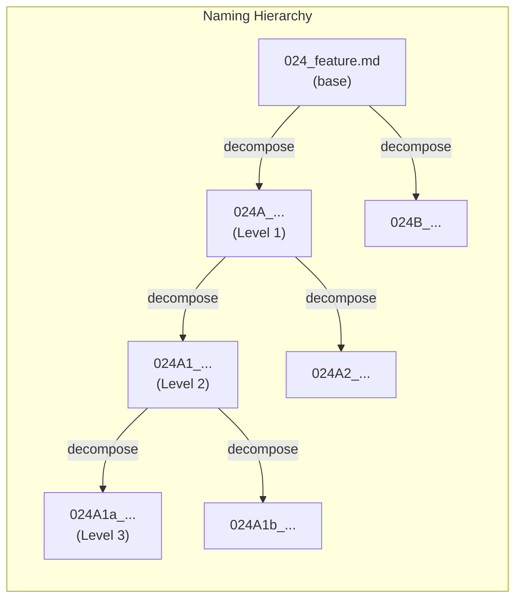
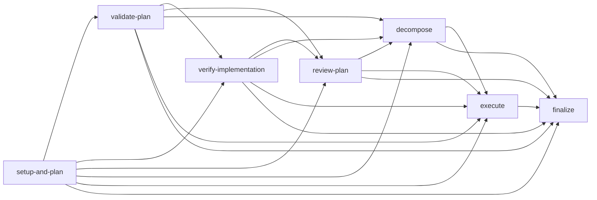
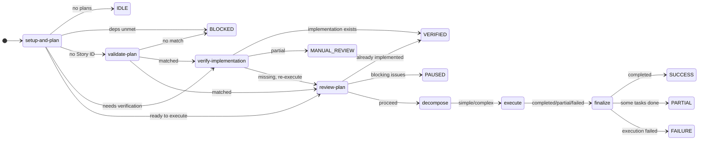

# Execute Stories Workflow (execute-stories.yml)

This document provides a detailed visualization of the `execute-stories.yml` workflow, which is the primary story execution pipeline.

---

## Overview

The execute-stories workflow processes TDD plan documents through a 7-stage pipeline:

1. **setup-and-plan**: Find plan, validate deps, initialize state
2. **validate-plan**: Ensure plan has valid Story ID (match to database if missing)
3. **verify-implementation**: Check if plan already implemented (for reviewing/verifying stages)
4. **review-plan**: Critical review, decide proceed/pause/verified
5. **decompose**: Assess complexity, split if needed (Opus)
6. **execute**: Follow plan's TDD steps directly (Sonnet)
7. **finalize**: Archive, commit, report

---

## Schedule & Triggers

| Trigger | Value |
|---------|-------|
| Schedule | `*/10 * * * *` (every 10 minutes) |
| Manual | `workflow_dispatch` |
| Concurrency | `daily-story-execution` (no cancel-in-progress) |

---

## Complete Pipeline Flow

```mermaid
flowchart TD
    START([Workflow Triggered<br/>Every 10 min or Manual])

    subgraph SETUP["1. setup-and-plan (10 min timeout)"]
        S1[Find plan files in<br/>.claude/data/plans/]
        S2{Plans found?}
        S3[Select earliest plan<br/>by hierarchical sequence]
        S4[Extract Story ID<br/>from plan]
        S5{Story ID found?}
        S6{Story already executed?<br/>stage = reviewing/verifying/etc}
        S7{Dependencies met?}
        S8[Move blocked plan<br/>to blocked/ folder]
        S9[Determine execution<br/>eligibility]
    end

    START --> S1
    S1 --> S2
    S2 -->|No| IDLE([Exit: No Plans])
    S2 -->|Yes| S3
    S3 --> S4
    S4 --> S5
    S5 -->|No| VALIDATE
    S5 -->|Yes| S6
    S6 -->|Yes| NEEDS_VERIFY["needs_verification=true"]
    S6 -->|No| S7
    S7 -->|No| S8
    S8 --> SKIP_DEPS([Exit: Blocked])
    S7 -->|Yes| S9
    NEEDS_VERIFY --> S9

    subgraph VALIDATE["2. validate-plan (15 min timeout)"]
        VP1[Read plan document]
        VP2[Query database for<br/>matching stories]
        VP3{Match found<br/>>80% confidence?}
        VP4[Add Story ID<br/>to plan]
        VP5[Commit plan update]
        VP6[Move plan to<br/>blocked/ folder]
    end

    S5 -->|No Story ID| VP1
    VP1 --> VP2
    VP2 --> VP3
    VP3 -->|Yes| VP4
    VP4 --> VP5
    VP5 --> S6
    VP3 -->|No| VP6
    VP6 --> BLOCKED_NO_ID([Exit: Blocked<br/>No Story ID])

    subgraph VERIFY["3. verify-implementation (15 min timeout)"]
        VI1[Read plan deliverables]
        VI2[Check if deliverables<br/>exist in codebase]
        VI3{Implementation<br/>exists?}
        VI4[Archive plan to<br/>executed/ folder]
        VI5[Reset story stage<br/>to planned]
    end

    NEEDS_VERIFY --> VI1
    VI1 --> VI2
    VI2 --> VI3
    VI3 -->|Pass| VI4
    VI4 --> VERIFIED([Exit: Verified])
    VI3 -->|Fail| VI5
    VI5 --> REVIEW
    VI3 -->|Partial| MANUAL_REVIEW([Exit: Manual Review])

    subgraph REVIEW["4. review-plan (15 min timeout)"]
        RP1[Read plan]
        RP2[Quick check:<br/>key deliverable exists?]
        RP3{Outcome}
    end

    S9 -->|should_execute=true| RP1
    VI5 --> RP1
    RP1 --> RP2
    RP2 --> RP3
    RP3 -->|verified| VERIFIED2([Exit: Already Implemented])
    RP3 -->|pause| PAUSED([Exit: Paused<br/>Blocking Issues])
    RP3 -->|proceed| DECOMPOSE
    RP3 -->|proceed_with_review| DECOMPOSE

    subgraph DECOMPOSE["5. decompose (20 min timeout, Opus)"]
        D1[Read plan completely]
        D2[Count TDD tasks]
        D3{Task count > 2?}
        D4[Create sub-plans<br/>with hierarchical names]
        D5[Move parent plan to<br/>decomposed/ folder]
        D6[Set execute_plan to<br/>first sub-plan]
    end

    RP3 -->|proceed| D1
    D1 --> D2
    D2 --> D3
    D3 -->|No: simple| EXECUTE
    D3 -->|Yes: complex| D4
    D4 --> D5
    D5 --> D6
    D6 --> EXECUTE

    subgraph EXECUTE["6. execute (45 min timeout, Sonnet)"]
        EX1[Read plan document]
        EX2[For each TDD task:]
        EX3[RED: Write failing test]
        EX4[Verify test fails]
        EX5[GREEN: Implement code]
        EX6[Verify test passes]
        EX7[Commit changes]
        EX8[Push implementation commits]
    end

    D3 -->|simple| EX1
    D6 --> EX1
    EX1 --> EX2
    EX2 --> EX3
    EX3 --> EX4
    EX4 --> EX5
    EX5 --> EX6
    EX6 --> EX7
    EX7 --> EX2
    EX7 -->|All tasks done| EX8
    EX8 --> FINALIZE

    subgraph FINALIZE["7. finalize (10 min timeout)"]
        F1[Determine final outcome]
        F2[Archive executed plan]
        F3[Update story status<br/>in database]
        F4[Commit & push]
        F5[Generate summary]
        F6[Post to GitHub issue]
    end

    EX8 --> F1
    F1 --> F2
    F2 --> F3
    F3 --> F4
    F4 --> F5
    F5 --> F6
    F6 --> SUCCESS([Exit: Success])
```

---

## Hierarchical Plan Naming

Plans use a hierarchical naming convention for parent-child relationships:

| Level | Format | Example |
|-------|--------|---------|
| Base | `NNN_name.md` | `024_timeline.md` |
| Level 1 | `NNNA_name.md` | `024A_timeline-validation.md` |
| Level 2 | `NNNAN_name.md` | `024A1_schema.md` |
| Level 3 | `NNNANa_name.md` | `024A1a_rules.md` |
| Level 4 | `NNNANaN_name.md` | `024A1a1_core.md` |

---

## Job Dependencies

---

## Outcome States

---

## Database Updates

| Outcome | New Stage | human_review |
|---------|-----------|--------------|
| success (no review needed) | `verifying` | 0 |
| success (review needed) | `reviewing` | 1 |
| partial | `reviewing` | 1 |
| verified | `implemented` | 0 |

---

## Models Used

| Job | Model | Purpose |
|-----|-------|---------|
| validate-plan | Sonnet 4.5 | Match plan content to database |
| verify-implementation | Sonnet 4.5 | Check if deliverables exist |
| review-plan | Sonnet 4.5 | Review plan for issues |
| decompose | **Opus 4.5** | Assess complexity, create sub-plans |
| execute | Sonnet 4.5 | Follow TDD steps |

---

## File Locations

| Type | Path |
|------|------|
| Active plans | `.claude/data/plans/*.md` |
| Blocked plans | `.claude/data/plans/blocked/` |
| Decomposed parents | `.claude/data/plans/decomposed/` |
| Executed plans | `.claude/data/plans/executed/` |
| Result files | `.claude/skills/story-execution/ci-*.json` |

---

## Result Files

Each Claude-powered job writes a result JSON:

| Job | Result File |
|-----|-------------|
| validate-plan | `ci-validate-result.json` |
| verify-implementation | `ci-verify-result.json` |
| review-plan | `ci-review-result.json` |
| decompose | `ci-decompose-result.json` |
| execute | `ci-execute-result.json` |

---

*Updated: 2025-12-23*
