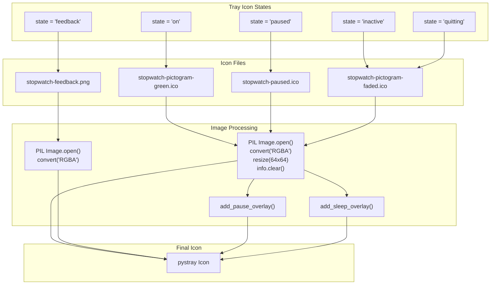
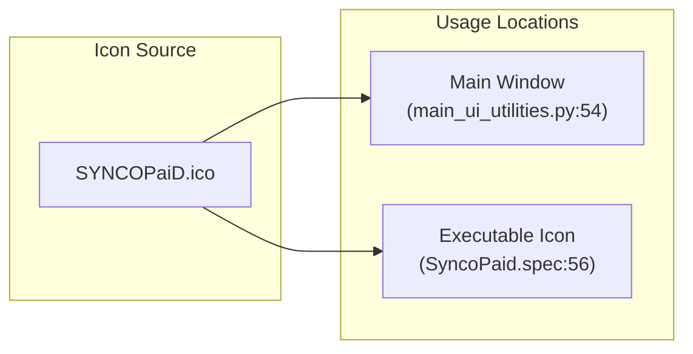
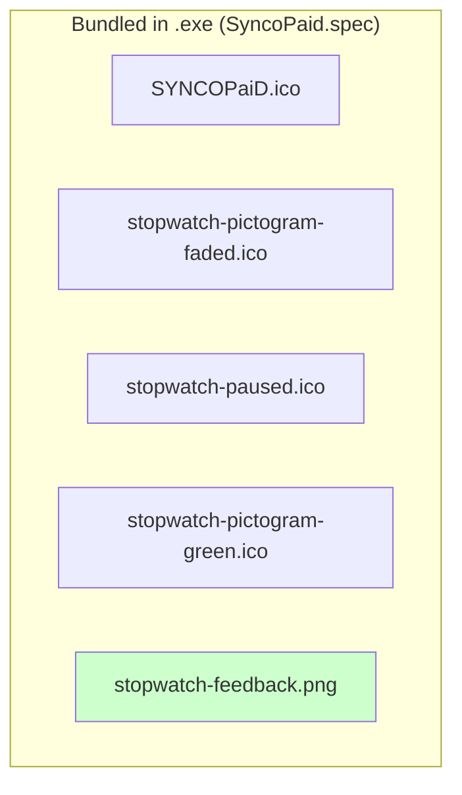

# Icon Usage Analysis

**Date**: 2025-12-26
**Status**: RESOLVED - Using pre-generated PNG for feedback state

## Icon Inventory

| Icon File | Used? | Purpose |
|-----------|-------|---------|
| `stopwatch-pictogram-green.ico` | Yes | Active tracking state |
| `stopwatch-pictogram-faded.ico` | Yes | Inactive/quitting states |
| `stopwatch-paused.ico` | Yes | Paused state |
| `stopwatch-feedback.png` | Yes | Feedback flash (pre-generated 64x64 PNG) |
| `SYNCOPaiD.ico` | Yes | Main window icon + exe icon |

## System Tray Icon Flow

## Main Window Icon Flow

## PyInstaller Bundle

## Resolution

The orange ICO invisibility issue was resolved by using a **pre-generated PNG** instead of:
- Loading orange ICO files directly (all failed)
- Runtime recoloring of green ICO (worked but was "ad hoc")

### Why PNG Works

1. PNG format is simpler and doesn't have ICO's multi-size complexity
2. The PNG is pre-generated at 64x64 (exact size needed for system tray)
3. No ICO metadata that could conflict with pystray's serialization

### Files Removed

The following orphaned files were deleted:
- `stopwatch-pictogram-orange.ico` - rendered invisible on Windows
- `stopwatch-pictogram-orange2.ico` - regeneration attempt, also invisible

### Root Cause (Unconfirmed)

The exact root cause of why orange ICO files rendered invisible was never identified. Likely hypotheses:
- PIL-saved ICOs differ from Inkscape-created ICOs in ways Windows rejects
- Color-specific rendering issues in Windows icon handling
- ICO metadata conflicts with pystray's serialization

The PNG solution bypasses all these potential issues.
