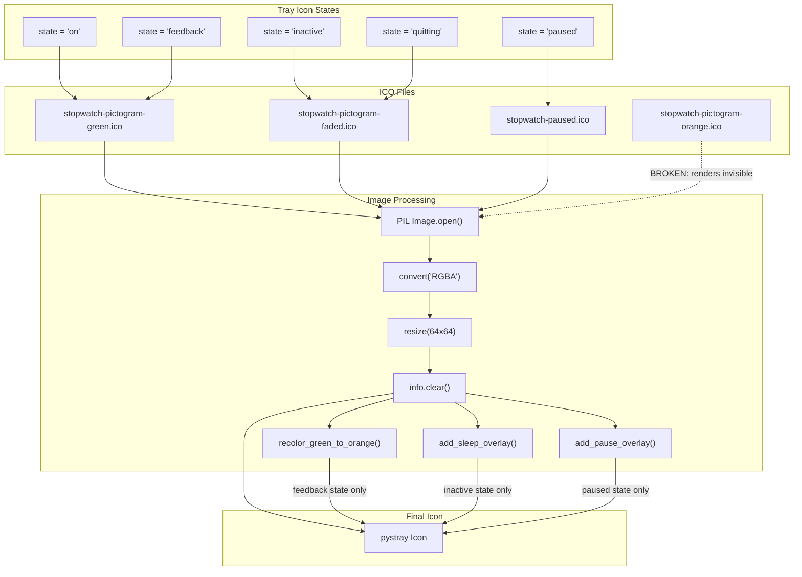
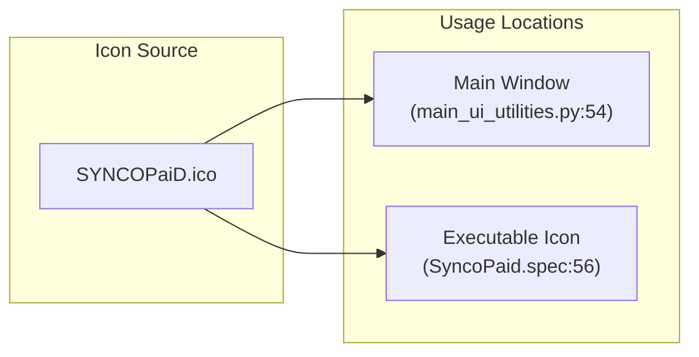
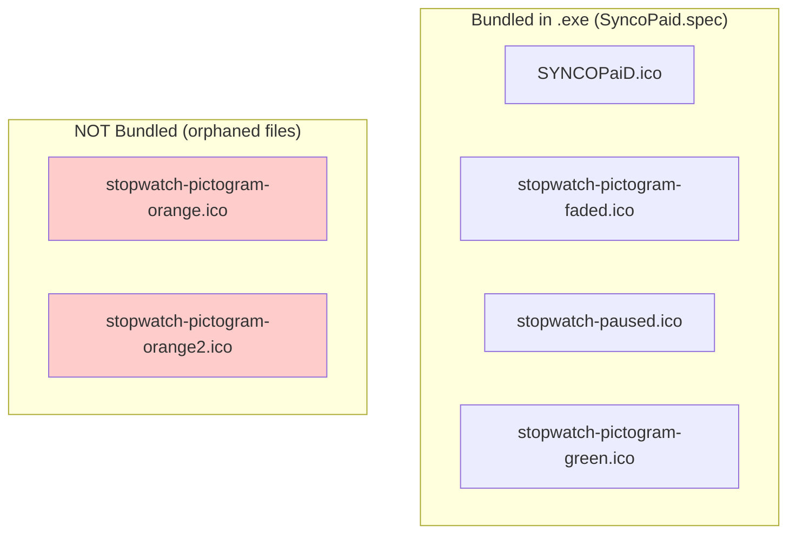
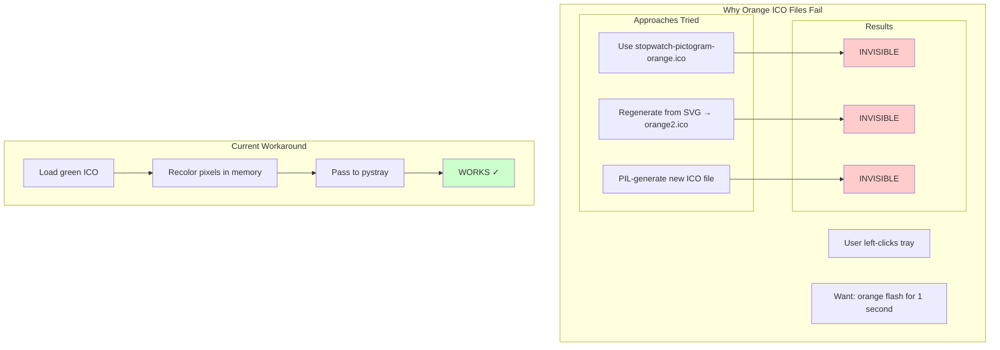

# Icon Usage Analysis

**Date**: 2025-12-26
**Purpose**: Document how ICO files are used in the codebase to understand the feedback icon issue.

## Icon Inventory

| Icon File | Used? | Purpose |
|-----------|-------|---------|
| `stopwatch-pictogram-green.ico` | ✓ | Active tracking state + feedback recolor source |
| `stopwatch-pictogram-faded.ico` | ✓ | Inactive/quitting states |
| `stopwatch-paused.ico` | ✓ | Paused state |
| `SYNCOPaiD.ico` | ✓ | Main window icon + exe icon |
| `stopwatch-pictogram-orange.ico` | ✗ | **UNUSED** - renders invisible |
| `stopwatch-pictogram-orange2.ico` | ✗ | **UNUSED** - regeneration attempt, also invisible |

## System Tray Icon Flow

## Main Window Icon Flow

## PyInstaller Bundle

## The Feedback Icon Problem

## Key Insight

The issue is NOT with:
- The orange color values
- The ICO file structure
- The PIL processing pipeline

The issue IS with:
- Any orange ICO **file** loaded from disk → invisible
- But modifying pixels **in memory** after loading green ICO → works

This suggests something about how these specific orange ICO files were created/saved that Windows/pystray doesn't like, but we haven't identified the root cause.
