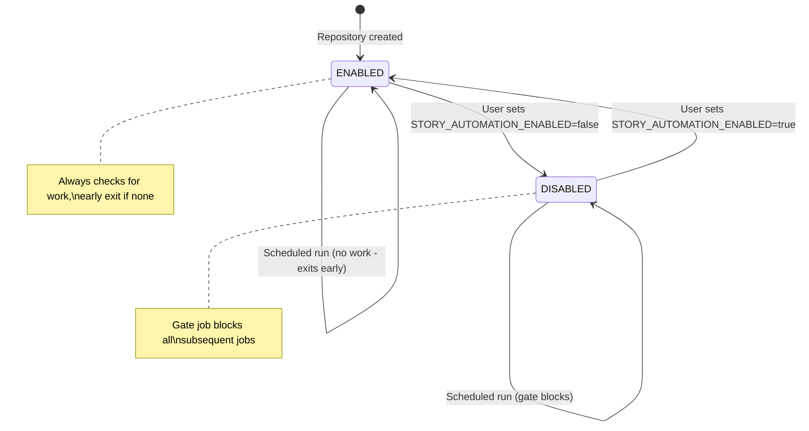

# Story Tree Meta-Workflow Design

This document describes the orchestration strategy for running multiple story-tree automation workflows sequentially, avoiding database conflicts while maintaining a simple enable/disable mechanism.

## Problem Statement

The project has three GitHub Actions workflows that all modify the same SQLite database:

| Workflow | Purpose | Current Schedule |
|----------|---------|------------------|
| `write-stories.yml` | Generate new concept stories | 2:00 AM PST |
| `plan-stories.yml` | Create implementation plans for approved stories | 2:30 AM PST |
| `synthesize-goals-non-goals.yml` | Generate vision documentation | 5:00 AM PST |

**Risks with independent scheduling:**
- Database merge conflicts if workflows overlap
- No coordination between workflows
- No way to detect "no work available" state
- No single control point to enable/disable automation

## Solution: Orchestrator Workflow

Create a single **orchestrator workflow** that runs the three tasks sequentially as jobs within one workflow run.

### Architecture

```
┌─────────────────────────────────────────────────────────────────┐
│                    story-tree-orchestrator                      │
│                  (runs daily at 2:00 AM PST)                    │
└──────────────────────────────┬──────────────────────────────────┘
                               │
                               ▼
                    ┌──────────────────────┐
                    │        GATE          │
                    │ Check if automation  │
                    │    is enabled        │
                    └──────────┬───────────┘
                               │
              ┌────────────────┼────────────────┐
              │                │                │
         [DISABLED]      [ENABLED]        [ENABLED]
              │                │           (manual)
              ▼                ▼                │
        ┌──────────┐  ┌───────────────────┐    │
        │   EXIT   │  │   write-stories   │◄───┘
        │ (skip)   │  │ Generate concepts │
        └──────────┘  └─────────┬─────────┘
                                │
                     ┌──────────┴──────────┐
                     │                     │
                [SUCCESS]            [NO_CAPACITY]
                     │                     │
                     └──────────┬──────────┘
                                │
                                ▼
                    ┌───────────────────────┐
                    │    plan-stories       │
                    │  Create impl plans    │
                    │  (pulls latest first) │
                    └─────────┬─────────────┘
                              │
                   ┌─────────┴─────────┐
                   │                   │
              [SUCCESS]          [NO_APPROVED]
                   │                   │
                   └─────────┬─────────┘
                             │
                             ▼
                   ┌───────────────────────┐
                   │   synthesize-goals    │
                   │   Update docs         │
                   │   (pulls latest)      │
                   └─────────┬─────────────┘
                             │
                             ▼
                   ┌───────────────────────┐
                   │       summary         │
                   │   Report results to   │
                   │   GITHUB_STEP_SUMMARY │
                   └───────────────────────┘
```

### Key Design Decisions

#### 1. Master Switch via Repository Variable

A single repository variable controls the entire automation:

```
Variable: STORY_AUTOMATION_ENABLED
Values: "true" | "false"
Default: "true"
Location: Settings > Secrets and variables > Actions > Variables
```

When set to `false`, the gate job exits early and all subsequent jobs are skipped.

#### 2. Sequential Jobs with Git Sync

Each job in the sequence:
1. Checks out the repository fresh
2. Pulls latest from main (to get previous job's changes)
3. Does its work
4. Commits and pushes if changes were made

This ensures each job sees the previous job's commits without conflicts.

#### 3. Concurrency Group

```yaml
concurrency:
  group: story-tree-automation
  cancel-in-progress: false
```

This prevents multiple orchestrator runs from overlapping.

#### 4. Early Exit on No Work

Each job can detect "no work available":

| Job | No-Work Signal | Meaning |
|-----|----------------|---------|
| write-stories | `NO_CAPACITY` | All tree nodes are at capacity |
| plan-stories | `NO_APPROVED` | No stories with status=approved |
| synthesize-goals | `NO_CHANGES` | Documentation already up to date |

When a job detects no work, it exits successfully and the next job continues. This is simpler than tracking "idle runs" - each run is cheap since it exits early.

## State Diagram



**Design note:** Earlier iterations included a `PAUSED` state that would auto-pause after N consecutive idle runs. This was removed as unnecessary complexity - the early-exit mechanism is sufficient and doesn't require persistent state tracking.

## Jobs Specification

### Job 1: gate

**Purpose:** Check if automation is enabled

```yaml
gate:
  runs-on: ubuntu-latest
  outputs:
    enabled: ${{ steps.check.outputs.enabled }}
  steps:
    - id: check
      run: |
        if [ "${{ vars.STORY_AUTOMATION_ENABLED }}" = "false" ]; then
          echo "enabled=false" >> $GITHUB_OUTPUT
          echo "Automation is disabled"
        else
          echo "enabled=true" >> $GITHUB_OUTPUT
        fi
```

### Job 2: write-stories

**Purpose:** Generate new concept stories for under-capacity nodes

**Triggers:** Runs if gate.enabled=true and not skipped via input

**Steps:**
1. Checkout with full git history
2. Run `python .claude/scripts/story_workflow.py --ci`
3. If output is `NO_CAPACITY`, set result output and skip Claude
4. Otherwise, run Claude Code to generate one story
5. Insert story via `insert_story.py`
6. Commit and push changes

**Outputs:**
- `result`: `SUCCESS` | `NO_CAPACITY` | `ERROR`
- `stories_created`: 0 or 1

### Job 3: plan-stories

**Purpose:** Create implementation plans for approved stories

**Triggers:** Runs after write-stories (success or no-capacity), if gate.enabled=true

**Steps:**
1. Checkout and pull latest (to get write-stories changes)
2. Query database for approved stories count
3. If count=0, set `NO_APPROVED` and skip Claude
4. Otherwise, run Claude Code with `story-planning-ci` skill
5. Commit and push changes

**Outputs:**
- `result`: `SUCCESS` | `NO_APPROVED` | `ERROR`
- `plans_created`: 0 or 1

### Job 4: synthesize-goals

**Purpose:** Update vision documentation from story tree

**Triggers:** Runs after plan-stories (success or no-approved), if gate.enabled=true

**Steps:**
1. Checkout and pull latest
2. Run Claude Code with `/visualize` command
3. Commit and push if changes made

**Outputs:**
- `result`: `SUCCESS` | `NO_CHANGES` | `ERROR`

### Job 5: summary

**Purpose:** Generate pipeline summary

**Triggers:** Always runs after all other jobs

**Steps:**
1. Collect results from all jobs
2. Write summary to `GITHUB_STEP_SUMMARY`

## Usage

### Enable/Disable Automation

To disable all story automation:
1. Go to repository Settings
2. Navigate to Secrets and variables > Actions > Variables
3. Set `STORY_AUTOMATION_ENABLED` to `false`

To re-enable:
1. Set `STORY_AUTOMATION_ENABLED` to `true`

### Manual Trigger with Options

The orchestrator supports manual dispatch with skip options:

```yaml
workflow_dispatch:
  inputs:
    skip_write:
      type: boolean
      default: false
      description: Skip story writing step
    skip_plan:
      type: boolean
      default: false
      description: Skip story planning step
    skip_synthesize:
      type: boolean
      default: false
      description: Skip goal synthesis step
```

### Running Individual Workflows

The original workflows (`write-stories.yml`, `plan-stories.yml`, `synthesize-goals-non-goals.yml`) can still be triggered manually via `workflow_dispatch` for testing or one-off runs.

## Implementation Files

| File | Purpose |
|------|---------|
| `.github/workflows/story-tree-orchestrator.yml` | Main orchestrator (to be created) |
| `.github/workflows/write-stories.yml` | Existing - kept for manual runs |
| `.github/workflows/plan-stories.yml` | Existing - kept for manual runs |
| `.github/workflows/synthesize-goals-non-goals.yml` | Existing - kept for manual runs |

## Design Evolution

### Version 1
- Used `workflow_call` to chain workflows
- **Flaw:** `workflow_call` makes workflows run as jobs in the same runner, not true sequential runs
- **Flaw:** Output communication from Claude Code action was complex

### Version 2
- Added status files for state persistence
- Added PAUSED state with idle run tracking
- **Flaw:** State files require commits, adding git history noise
- **Flaw:** PAUSED state added unnecessary complexity

### Version 3 (Final)
- Simplified to two states: ENABLED and DISABLED
- No persistent state files - early exit is sufficient
- Single repository variable as master switch
- Each job pulls latest before committing to avoid conflicts
